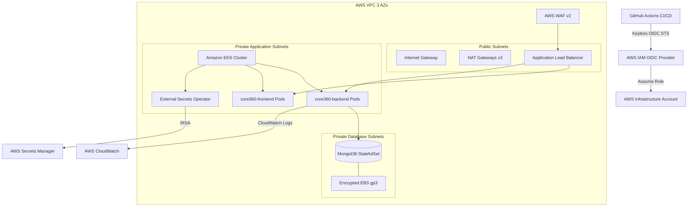

# Core360 Enterprise AWS Architecture Specification & Diagrams

```mermaid
graph TD
    GH[GitHub Actions CI/CD] -->|Keyless OIDC STS| IAM[AWS IAM OIDC Provider]
    IAM -->|Assume Role| AWS[AWS Infrastructure Account]

    subgraph AWS VPC 3 AZs
        IGW[Internet Gateway]
        NAT[NAT Gateways x3]
        WAF[AWS WAF v2] --> ALB[Application Load Balancer]
        
        subgraph Public Subnets
            ALB
            IGW
            NAT
        end
        
        subgraph Private Application Subnets
            EKS[Amazon EKS Cluster]
            BE[core360-backend Pods]
            FE[core360-frontend Pods]
            ESO[External Secrets Operator]
            EKS --> BE
            EKS --> FE
            EKS --> ESO
        end
        
        subgraph Private Database Subnets
            DB[(MongoDB StatefulSet)]
            EBS[Encrypted EBS gp3]
            DB --- EBS
        end
    end

    BE --> DB
    ALB --> FE
    ALB --> BE
    ESO -->|IRSA| SM[AWS Secrets Manager]
    BE -->|CloudWatch Logs| CW[AWS CloudWatch]
```
